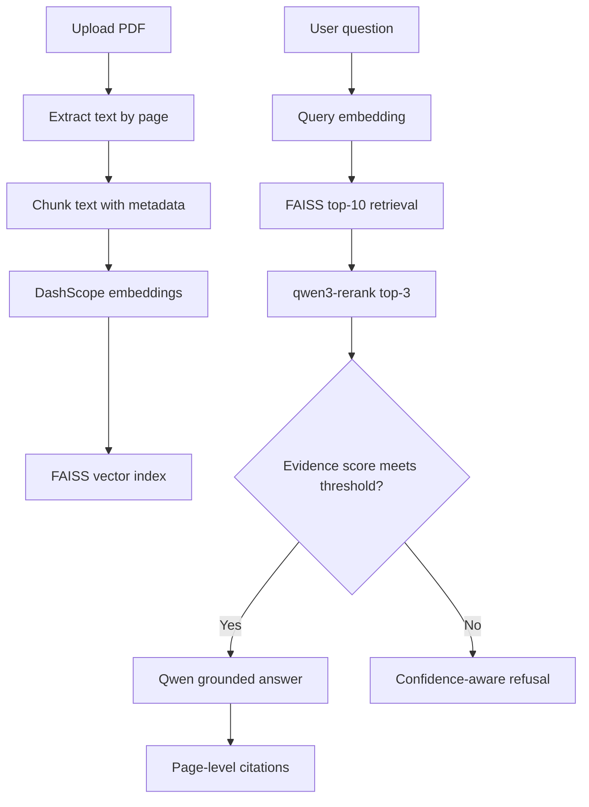
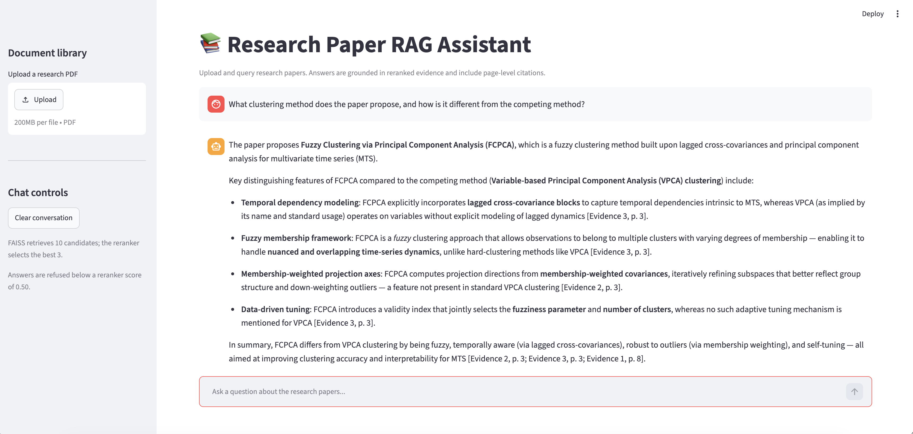
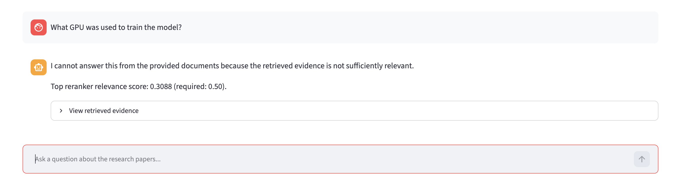

# Trustworthy Research Paper RAG Assistant

A Streamlit-based assistant for querying research PDFs with retrieval-augmented generation (RAG), page-level citations, reranking, and confidence-aware refusal.

## Features

- Upload research PDFs through a Streamlit interface
- Extract text page by page and preserve source/page metadata
- Chunk documents and create DashScope embedding vectors
- Retrieve relevant passages with a local FAISS vector index
- Rerank the top FAISS candidates with `qwen3-rerank`
- Generate grounded answers with Qwen and page-level citations
- Support multi-turn chat
- Refuse to answer when retrieved evidence is not sufficiently relevant
- Compare baseline FAISS retrieval with reranked retrieval using Recall@3

## Architecture



## Retrieval Evaluation

The project evaluates four manually verified research-paper questions.

| Retrieval approach | Recall@3 |
| --- | ---: |
| FAISS only | 75.0% (3/4) |
| FAISS top-10 + qwen3-rerank top-3 | 100.0% (4/4) |

This is a small proof-of-concept evaluation rather than a large benchmark. A larger evaluation set, multiple document collections, and more unsupported questions would be needed for a robust production evaluation.

## Examples

### Grounded Answer



### Confidence-Aware Refusal



## Project Structure

```text
trustworthy-research-paper-rag-assistant/
├── app.py
├── requirements.txt
├── src/
│   ├── ingest.py
│   ├── build_index.py
│   ├── search.py
│   ├── reranker.py
│   ├── rag_pipeline.py
│   └── evaluate_retrieval.py
├── tests/
│   └── evaluation_questions.json
├── assets/
│   ├── grounded_answer.png
│   └── confidence_refusal.png
└── data/
    ├── raw_pdfs/
    ├── processed/
    └── vector_store/
```

## Setup

Clone the repository:

```bash
git clone https://github.com/arbitraryma/trustworthy-research-paper-rag-assistant.git
cd trustworthy-research-paper-rag-assistant
```

Create and activate a virtual environment:

```bash
python -m venv .venv
source .venv/bin/activate
```

Install dependencies:

```bash
pip install -r requirements.txt
```

Create a `.env` file in the project root:

```env
DASHSCOPE_API_KEY=your_api_key_here
DASHSCOPE_BASE_URL=your_dashscope_compatible_mode_endpoint_here
```

Do not commit `.env` or your API key to GitHub.

## Run the App

```bash
streamlit run app.py
```

Open the local URL shown in the terminal, upload one or more PDFs, and ask questions in the chat interface.

## Evaluate Retrieval

```bash
python -m src.evaluate_retrieval
```

## Limitations and Future Work

- Retrieval quality depends on PDF text extraction and chunking strategy.
- Confidence thresholds need calibration on a larger labelled evaluation set.
- The current evaluation set is small.
- A production version could add hybrid retrieval, better citation validation, document management, user authentication, rate limits, and persistent cloud storage.